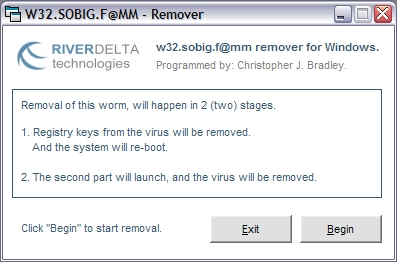



## w32\.sobig\.f@mm remover

### Description

This will remove the SOBIG virus. Nothing greatly fantastic, feel free to post creative comments or suggestions. Any 'flaming' will be removed, and reported.
 
### More Info
 

             |
---                |---
**Submitted On**   |2003-08-15 14:57:48
**By**             |[Chris Blaker](https://github.com/Planet-Source-Code/PSCIndex/blob/master/ByAuthor/chris-blaker.md)
**Level**          |Intermediate
**User Rating**    |5.0 (20 globes from 4 users)
**Compatibility**  |VB 6\.0
**Category**       |[Miscellaneous](https://github.com/Planet-Source-Code/PSCIndex/blob/master/ByCategory/miscellaneous__1-1.md)
**World**          |[Visual Basic](https://github.com/Planet-Source-Code/PSCIndex/blob/master/ByWorld/visual-basic.md)
**Archive File**   |[w32\_sobig\_1633468212003\.zip](https://github.com/Planet-Source-Code/chris-blaker-w32-sobig-f-mm-remover__1-47896/archive/master.zip)

